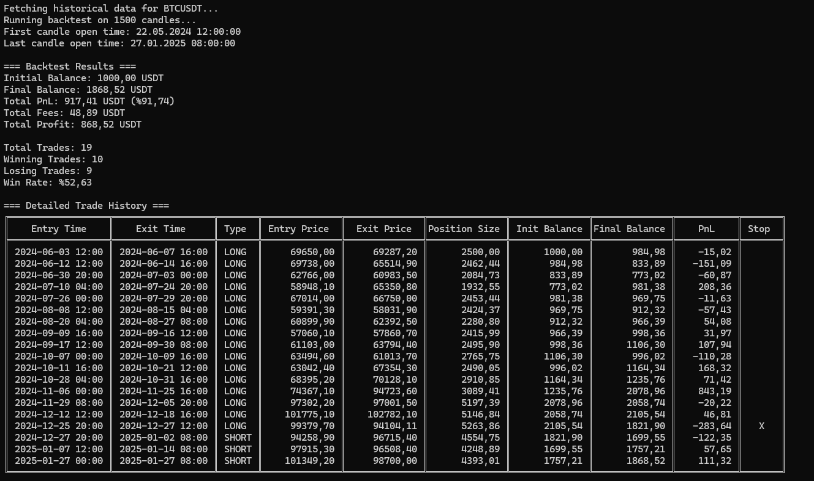

# AlgoTradeBacktester

A .NET 8-based cryptocurrency algorithmic trading backtester that evaluates trading strategies using Binance Futures historical data. The project implements the Supertrend indicator strategy with configurable parameters while maintaining an extensible architecture for testing different trading strategies.

The system features a clean architecture design with dependency injection, allowing for modular strategy implementation and sophisticated risk management. It calculates key performance metrics including PnL, win rates, and risk-adjusted returns while handling position sizing and automated trade execution rules.

## Features

- Historical data fetching from Binance Futures API
- Modular strategy implementation system
- Risk management with configurable parameters
- Detailed trade analysis and performance metrics
- Support for different timeframes
- Comprehensive backtesting results including:
  - Total PnL
  - Win rate
  - Trading fees
  - Individual trade details
  - Risk-adjusted position sizing

## Tech Stack

- **.NET 8.0**
- **C# 12**
- **Binance.Net:** Official Binance API client
- **Microsoft.Extensions.DependencyInjection:** For IoC container
- **Microsoft.Extensions.Logging:** For structured logging

## Technical Architecture

- **Clean Architecture:** Separation of concerns with clear boundaries between layers
- **SOLID Principles:** Emphasis on interface-based design and dependency injection
- **Dependency Injection:** Using Microsoft.Extensions.DependencyInjection
- **Repository Pattern:** For data access abstraction
- **Strategy Pattern:** For implementing different trading strategies

## Project Structure

The solution follows a clean architecture pattern and is organized as follows:

```
AlgoTradeBacktester/
├── AlgoTradeBacktester.Core/                 # Core domain layer
│   ├── Constants/
│   │   └── TradingConstants.cs               # Trading-related configuration values
│   ├── Interfaces/
│   │   ├── IExchangeService.cs               # Exchange data fetching contract
│   │   ├── IRiskManager.cs                   # Risk management operations contract
│   │   └── IStrategyService.cs               # Trading strategy contract
│   └── Models/
│       ├── BacktestResult.cs                 # Backtest performance metrics
│       ├── Candle.cs                         # Price/volume data structure
│       └── Position.cs                       # Trade position details
│
├── AlgoTradeBacktester.Services/             # Implementation layer
│   ├── ExchangeService.cs                    # Binance API integration
│   ├── RiskManager.cs                        # Position sizing and risk calculations
│   └── Strategies/
│       └── SupertrendStrategy.cs             # Supertrend indicator implementation
│
└── AlgoTradeBacktester.Console/              # Presentation layer
    └── Program.cs                            # Entry point and DI configuration
```

## Trading Strategy

The current implementation uses the Supertrend indicator strategy:

- **Indicator Parameters:**
  - ATR Period: 10
  - ATR Multiplier: 3.0

- **Entry Rules:**
  - Long: When price closes above the Supertrend line
  - Short: When price closes below the Supertrend line

- **Exit Rules:**
  - Long positions: When price closes below the Supertrend line
  - Short positions: When price closes above the Supertrend line
  - Stop-loss: 2% from entry price

## Risk Management

The system implements sophisticated risk management features:

- Position sizing based on account risk percentage
- Per-trade risk limits
- Stop-loss implementation
- Fee calculation and tracking

## Example Output

Below is a sample console output showing the backtest results for the Supertrend strategy:



The output includes:
- Initial and final balances
- Total PnL and fees
- Win rate statistics
- Detailed trade history with entry/exit prices

## Getting Started

1. Clone the repository
2. Ensure .NET 8 SDK is installed
3. Build the solution:

```bash
dotnet build
```

4. Run the backtester:

```bash
dotnet run --project AlgoTradeBacktester.Console
```

## Future Improvements

- Additional trading strategies
- Performance optimizations for large datasets
- Real-time trading capabilities
- Web-based UI for strategy configuration
- Machine learning integration for strategy optimization
- Support for multiple exchanges
